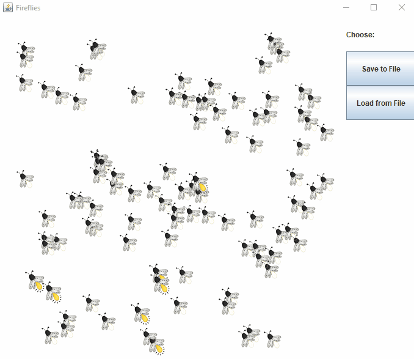

# FireflyBehavior
A Java Swing application that displays the flashing behavior of fireflies in nature. 

## Real Life Similarity
In the wild, fireflies display a natural tendency to synchronize their flashing. They will even synchronize their flashing with a pretend firefly. For example: https://www.youtube.com/watch?v=ZGvtnE1Wy6U. Synchronization can be modeled mathematically and simulated using some reasonably simply mathematics borrowed from how coupled oscillators work. In this project, each firefly is aware of others around it and adapts its flashing accordingly.

Flashing occurs depending on the following equation:
&delta;&phi;/&delta;t = &omega; + K * N * Sin( 2&pi; - &phi;))

## Saving and Loading
Users can save a firefly formation to a file.
If needed, they can load up formations on the spot and display them.
